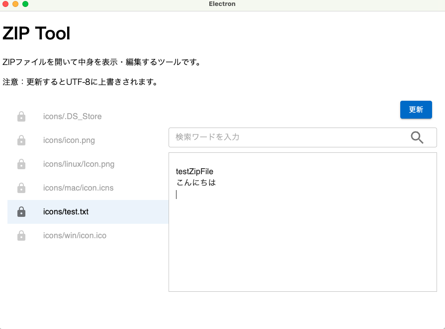

# zip-tool
このアプリは練習用プロジェクトです。 
An Electron application with React, TypeScript, and Rust (WASM).  
パスワード付き ZIP の展開やファイルリスト表示をサポートします。

## Features

- Electron + Vite + React によるデスクトップアプリ
- Rust (wasm) による文字コード判定と ZIPのリスト処理
- node-7z による ZIP の解凍・編集・保存をまとめて処理します
- 日本語ファイル名 / Shift_JIS 対応
- パスワード付き ZIP に対応
- macOS でのみ動作確認済み

---

### Useage
1. ZIP ファイルを右クリックし、「**このアプリケーションで開く**」> 「**ZipTool**」を選択します。
2. 下記のように、ZIP 内のファイルリストと内容が表示されます。
> 注意: ファイルを更新すると UTF-8 で上書き保存されます。



## Recommended IDE Setup

- [VSCode](https://code.visualstudio.com/) + [ESLint](https://marketplace.visualstudio.com/items?itemName=dbaeumer.vscode-eslint) + [Prettier](https://marketplace.visualstudio.com/items?itemName=esbenp.prettier-vscode)

## Project Setup

### Install

```bash
npm install
```

wasm のソース (wasm-src/) から .wasm ファイルを生成する場合は、初回のみ Rust の wasm ターゲットを追加してください。
Rust がインストールされていない場合は [Rust公式](https://www.rust-lang.org/) の手順でインストールしてください。
```bash
npm run wasm:target
```
ビルド成果物は dist/ に出力されます。

### Build
```bash
npm run dist
```

もし .wasm ファイルを更新した場合は、以下を実行してください。
```bash
npm run wasm:build
```

